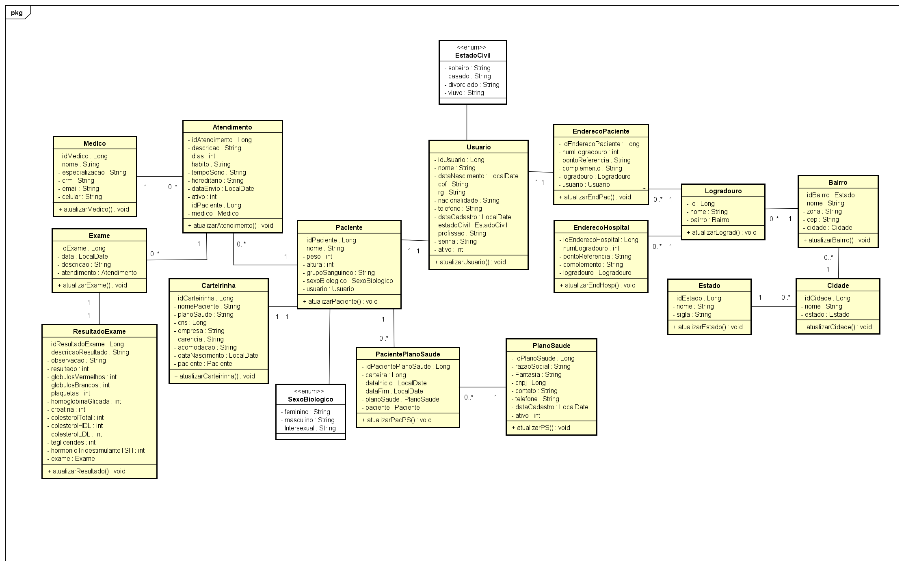
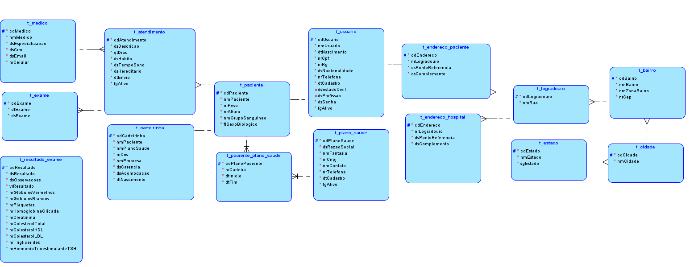
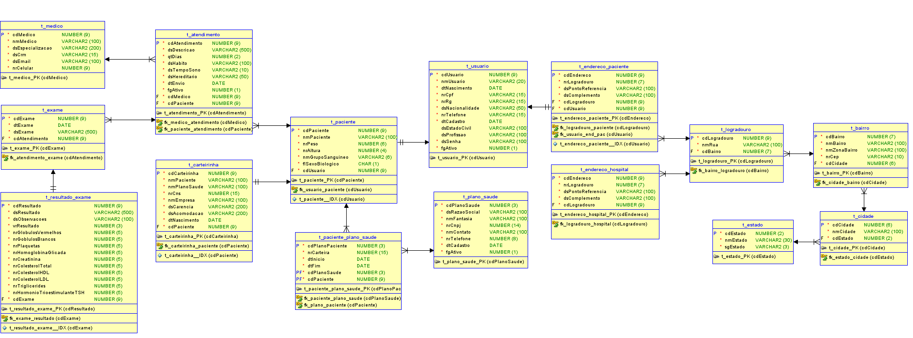

# Aplicação: CareMI

### Link do Repositório: https://github.com/nicollyADS/CareMI-API

### Integrantes do Grupo
- **Nome:** Alberto Seiji Assato - rm99977
  - **Apresentação:** Responsável pela criação do script do vídeo com a proposta tecnológica, o público-alvo da aplicação e os
problemas que a aplicação se propõe a solucionar.

- **Nome:** Matheus Rodrigues Oliveira - rm551997
  - **Apresentação:** Responsável pela criação do diagrama de entidade e relacionamento (DER) e Modelo Entidade Relacionamento (MER).

- **Nome:** Miguel Francisco de Freitas Fernandes - rm99997 
  - **Apresentação:** Responsável pela inicialização do repositório e criação da documentação do cronograma de desenvolvimento.

- **Nome:** Nicolly de Almeida Gonçalves - rm552579
  - **Apresentação:** Responsável por criar o diagrama de classes, realizar a implementação das models, controllers, repositories e data object transfer (DTO). Além de efetuar o mapeamento dos relacionamentos, validação das classes e criação de queries.

- **Nome:** Patrick de Lima Jaguski - rm551521
  - **Apresentação:** Responsável pela produção e postagem do vídeo com a proposta tecnológica, o público-alvo da aplicação e os
problemas que a aplicação se propõe a solucionar.

### Instruções para Executar a Aplicação

1. Clone o repositório para sua máquina local
2. Certifique-se de ter o Java JDK instalado em sua máquina
3. Atualize a versão do JDK no projeto
4. Carregue o projeto com Maven
5. Instale o plugin do Lombok e habilite
6. Configure o arquivo "application.properties" e coloque as suas credenciais do banco de dados
7. Após ter configurado o ambiente, inicialize o projeto 
8. Para fazer as requisições, utilize a URL `http://localhost:8080`

### Diagramas

A seguir estão os diagramas do projeto:

#### Diagrama de Classes

#### Diagrama de Entidade e Relacionamento (DER)

#### Modelo Entidade Relacionamento (MER)

### Vídeo de Apresentação

Assista ao vídeo de apresentação da proposta tecnológica, público-alvo e problemas que a aplicação se propõe a solucionar [aqui](https://www.youtube.com/watch?v=Inv55aaUWZo).

#### Listagem de Endpoints - Documentação da API
**Atendimento** 
- **GET:** `/atendimentos` - lista todos os atendimentos
- **GET BY ID:** `/atendimentos/{id}` - lista o atendimento com o id que foi passado
- **PUT:** `/atendimentos/{id}` - atualiza as informações do atendimento com o id que foi passado
- **POST:** `/atendimentos` - cria um atendimento
- **DELETE:** `/atendimentos/{id}` - deleta um atendimento
- **POST EXAME:** `/atendimentos/{id}/exames` - adiciona um exame a um atendimento existente
- **GET ATENDIMENTOS POR MÉDICO:** `/atendimentos/por-medico` - lista os atendimentos filtrados por médico, fornecendo o parametro `id-medico`
- **GET ATENDIMENTOS POR PACIENTE:** `/atendimentos/por-paciente` - lista os atendimentos filtrados por paciente, fornecendo o parametro `id-paciente`

**Autenticacao**
- **POST:** `/login` - gera um token quando o login é realizado 

**Bairro**
- **GET:** `/bairros` - lista todos os bairros
- **GET BY ID:** `/bairros/{id}` - lista o bairro com o id que foi passado
- **PUT:** `/bairros/{id}` - atualiza as informações do bairro com o id que foi passado
- **POST:** `/bairros` - cria um bairro
- **DELETE:** `/bairros/{id}` - deleta um bairro
- **POST LOGRADOUROS:** `/bairros/{id}/logradouros` - adiciona um logradouro a um bairro existente

**Cidade**
- **GET:** `/cidades` - lista todas as cidades
- **GET BY ID:** `/cidades/{id}` - lista a cidade com o id que foi passado
- **PUT:** `/cidades/{id}` - atualiza as informações da cidade com o id que foi passado
- **POST:** `/cidades` - cria uma cidade
- **DELETE:** `/cidades/{id}` - deleta uma cidade
- **POST BAIRRO:** `/cidades/{id}/bairros` - adiciona um bairro a uma cidade existente

**Endereco Hospital**
- **GET:** `/enderecos-hospitais` - lista todos os endereços de hospitais
- **GET BY ID:** `/enderecos-hospitais/{id}` - lista o endereço de hospital com o id que foi passado
- **PUT:** `/enderecos-hospitais/{id}` - atualiza as informações do endereço de hospital com o id que foi passado
- **DELETE:** `/enderecos-hospitais/{id}` - deleta um endereço de hospital

**Endereco Hospital**
- **GET:** `/enderecos-pacientes` - lista todos os endereços dos pacientes
- **GET BY ID:** `/enderecos-pacientes/{id}` - lista o endereço do paciente com o id que foi passado
- **POST:** `/enderecos-pacientes` - cria um endereco para o paciente
- **PUT:** `/enderecos-pacientes/{id}` - atualiza as informações de endereço do paciente com o id que foi passado
- **DELETE:** `/enderecos-pacientes/{id}` - deleta um endereço do paciente

**Estado**
- **GET:** `/estados` - lista todos os estados
- **GET BY ID:** `/estados/{id}` - lista o estado com o id que foi passado
- **PUT:** `/estados/{id}` - atualiza as informações do estado com o id que foi passado
- **POST:** `/estados` - cria um estado
- **DELETE:** `/estados/{id}` - deleta um estado
- **POST CIDADE:** `/estados/{id}/cidades` - adiciona uma cidade a um estado existente

**Exame**
- **GET:** `/exames` - lista todos os exames
- **GET BY ID:** `/exames/{id}` - lista o exame com o id que foi passado
- **PUT:** `/exames/{id}` - atualiza as informações do exame com o id que foi passado
- **POST:** `/exames` - cria um exame
- **DELETE:** `/exames/{id}` - deleta um exame
- **GET EXAMES POR DATA:** `/exames/por-data` - lista os exames agendados para uma data específica, fornecendo o parâmetro `data`

**Logradouro**
- **GET:** `/logradouros` - lista todos os logradouros
- **GET BY ID:** `/logradouros/{id}` - lista o logradouro com o id que foi passado
- **PUT:** `/logradouros/{id}` - atualiza as informações do logradouro com o id que foi passado
- **DELETE:** `/logradouros/{id}` - deleta o logradouro
- **POST ENDERECO HOSPITAL:** `/logradouros/{id}/enderecos-hospitais` - adiciona um novo endereço de hospital ao logradouro especificado

**Medico**
- **GET:** `/medicos` - lista todos os médicos
- **GET BY ID:** `/medicos/{id}` - lista o médico com o id que foi passado
- **PUT:** `/medicos/{id}` - atualiza as informações do médico com o id que foi passado
- **POST:** `/medicos` - cria um médico
- **DELETE:** `/medicos/{id}` - deleta um médico

**Pacientes**
- **GET:** `/pacientes` - lista todos os pacientes
- **GET BY ID:** `/pacientes/{id}` - lista o paciente com o ID que foi passado
- **POST:** `/pacientes` - cadastra um novo paciente
- **DELETE:** `/pacientes/{id}` - deleta o paciente
- **PUT:** `/pacientes/{id}` - atualiza as informações do paciente com o ID que foi passado
- **GET PACIENTES POR NOME:** `/pacientes/por-nome` - busca pacientes pelo nome, fornecendo o parâmetro `nome`

**Paciente Plano de Saude**
- **GET:** `/pacientes-planos-saude` - lista todos os pacientes com plano de saúde
- **GET BY ID:** `/pacientes-planos-saude/{id}` - lista o paciente com plano de saúde com o id que foi passado
- **PUT:** `/pacientes-planos-saude/{id}` - atualiza as informações do paciente com plano de saúde com o id que foi passado
- **POST:** `/pacientes-planos-saude` - cria um paciente com plano de saúde
- **DELETE:** `/pacientes-planos-saude/{id}` - deleta um paciente com plano de saúde

**Plano de Saude**
- **GET:** `/planos-saude` - lista todos os planos de saúde
- **GET BY ID:** `/planos-saude/{id}` - lista o plano de saúde com o id que foi passado
- **PUT:** `/planos-saude/{id}` - atualiza as informações do plano de saúde com o id que foi passado
- **POST:** `/planos-saude` - cria um plano de saúde
- **DELETE:** `/planos-saude/{id}` - deleta um plano de saúde

**Usuários**
- **GET:** `/usuarios` - lista todos os usuários
- **GET BY ID:** `/usuarios/{id}` - lista o usuário com o id que foi passado
- **POST:** `/usuarios/register` - cadastra um novo usuario
- **DELETE:** `/usuarios/{id}` - deleta o usuário com o id que foi passado
- **PUT:** `/usuarios/{id}` - atualiza as informações do usuário com o id que foi passado
- **GET USUARIOS POR CPF:** `/usuarios/por-cpf` - busca usuários pelo CPF, fornecendo o parâmetro `cpf`
- **GET USUARIOS POR RG:** `/usuarios/por-rg` - busca usuários pelo RG, fornecendo o parâmetro `rg`.

